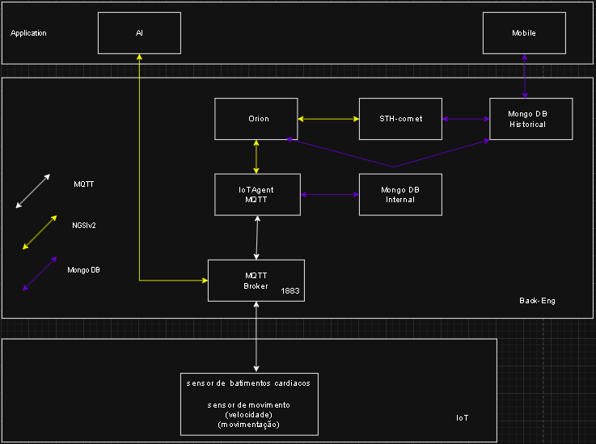

# 🏃‍♂️ IoT - Monitoramento de Atletas  

Este projeto é uma solução IoT para monitoramento de **batimento cardíaco**, **velocidade** e **distância percorrida** por atletas em tempo real.  
Os dados coletados pelos sensores são enviados via **MQTT**, processados em uma arquitetura baseada em **FIWARE**, armazenados em **MongoDB** e disponibilizados para um **aplicativo móvel** e uma camada de **IA**.  

---

## 🚀 Objetivo  
Fornecer uma solução que permita:  
- Monitorar dados vitais e de performance de atletas em tempo real.  
- Armazenar e analisar o histórico de informações.  
- Exibir os dados em um **aplicativo mobile** de forma acessível.  
- Utilizar **Inteligência Artificial** para gerar insights sobre o desempenho do atleta.  

---

## 🏗️ Arquitetura do Sistema  

 

### 📌 Componentes Principais  

1. **Dispositivos IoT**  
   - Sensor de batimentos cardíacos  
   - Sensor de movimento (velocidade e distância)  

2. **Back-End (FIWARE + Broker MQTT)**  
   - **MQTT Broker (1883):** recebe os dados dos sensores.  
   - **IoT Agent MQTT:** traduz dados MQTT para NGSI-v2.  
   - **Orion Context Broker:** gerencia o contexto e disponibiliza informações em tempo real.  
   - **STH-Comet:** armazena séries temporais.  
   - **MongoDB:**  
     - *Internal* → suporte ao Orion e IoT Agent.  
     - *Historical* → armazenamento histórico de dados.  

3. **Aplicações**  
   - **Mobile App:** exibição dos dados do atleta.  
   - **AI:** análises avançadas de performance (ex.: previsões, alertas).  

---

## 🔗 Fluxo de Dados  

1. Os sensores coletam dados (batimento, velocidade, distância).  
2. Os dados são enviados via **MQTT** para o **Broker**.  
3. O **IoT Agent MQTT** converte mensagens para o padrão **NGSI-v2**.  
4. O **Orion** gerencia e distribui os dados em tempo real.  
5. O **STH-Comet** registra séries temporais no **MongoDB**.  
6. O **Aplicativo Mobile** consome informações processadas.  
7. A **IA** analisa dados para gerar insights.  

---

## ⚙️ Tecnologias Utilizadas  

- **IoT:** sensores de batimentos e movimento.  
- **Comunicação:** MQTT (Mosquitto).  
- **FIWARE Components:**  
  - Orion Context Broker  
  - IoT Agent MQTT  
  - STH-Comet  
- **Banco de Dados:** MongoDB  
- **Aplicações:** Mobile App + Inteligência Artificial  

---

## 📱 Aplicativo Mobile  

- Exibe batimentos cardíacos em tempo real.  
- Mostra velocidade atual e distância total percorrida.  
- Histórico de treinos armazenado no banco.  
- Alertas para situações críticas (ex.: batimento muito alto).  

---

## 🤖 Inteligência Artificial  

- Previsão de desempenho com base no histórico.  
- Identificação de padrões de esforço físico.  
- Alertas personalizados de fadiga ou risco.  

---

## ▶️ Como Executar  

1. Suba os serviços do FIWARE (Docker Compose recomendado).  
2. Configure o **MQTT Broker (Mosquitto)**.  
3. Registre os dispositivos no **IoT Agent MQTT**.  
4. Inicie a coleta de dados dos sensores.  
5. Acesse o **Mobile App** para visualizar as métricas.  

---

## 📌 Futuras Melhorias  

- Integração com **wearables reais (ex: pulseiras inteligentes)**.  
- Dashboard web para técnicos acompanharem múltiplos atletas.  
- Modelos de IA mais avançados para previsão de performance.  
